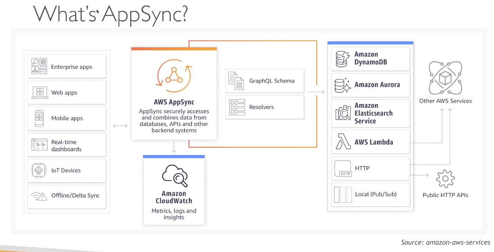

# udemy-appsync-amplify

> Udemy course: [AWS AppSync &amp; Amplify with React &amp; GraphQL](https://www.udemy.com/course/aws-appsync-amplify-with-react-graphql-course/)

-   AWS AppSync and Amplify fundamentals
-   Amazon Cognito
-   Fundamentals of GraphQL
-   React app using AppSync Backend API
-   DynamoDB

## Obligatory React Scripts

-   `npm start`
-   `npm run build`
-   `npm test`

Also, [deployment instructions](https://create-react-app.dev/docs/deployment/) (including a section on AWS Amplify)

## AppSync

## Amplify CLI

[AWS Amplify](https://docs.amplify.aws/cli) is a JavaScript library which simplifies the development process. It has many modules, such as Auth, Analytics, Storage, API, Caching, UI Components, and more. These provide boilerplate code to get started quickly.

In order to work with Amplify, you need to [install the CLI](https://docs.amplify.aws/cli/start/install) and run `amplify configure`, then follow the prompts.
